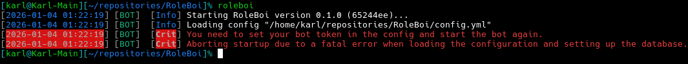
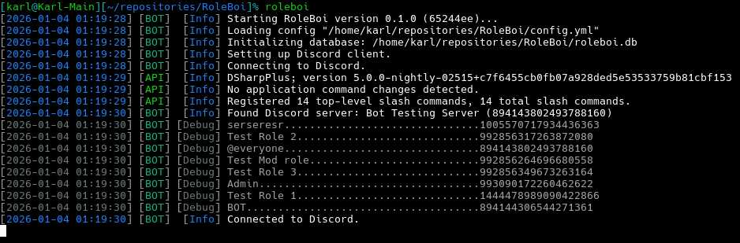
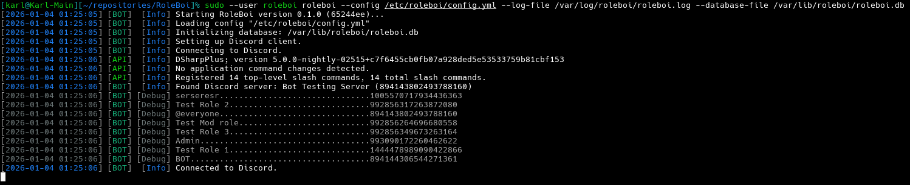
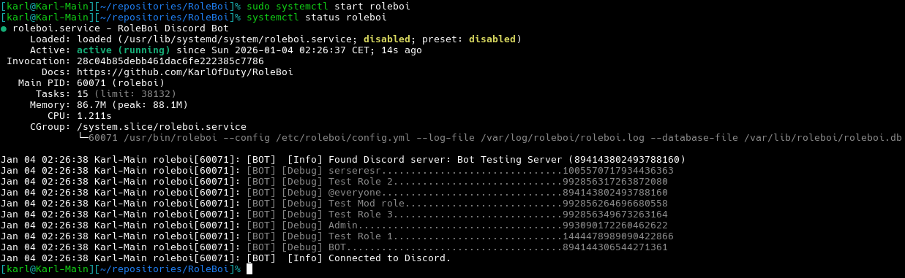

# Installation and Setup

## Installing the Bot

The bot is tested on the following operating systems:
- Arch
- Debian 12
- Fedora 42
- RHEL 10
- Ubuntu 24.04
- Windows 10

> [!NOTE]
> The bot should work on other versions of the above systems and other distributions based on them.
> However, you must use an x64 architecture operating system. Arm systems such as the Raspberry Pi are not supported at this time.
> 
> Please open an issue or contact me in Discord immediately if any of the packages don't work properly on a specific distribution.

### Installation Instructions

<details>
<summary><b>Ubuntu-based (Ubuntu, Pop!_OS, Mint, Zorin, etc)</b></summary>
<br/>

RoleBoi is available in the repository at repo.karlofduty.com.

**1.** Installing the dotnet repository (Only needed for Ubuntu 24.04 and older):
```bash
sudo add-apt-repository ppa:dotnet/backports
sudo apt update
```

**2.** Installing the repo.karlofduty.com repository:
```bash
wget https://repo.karlofduty.com/ubuntu/dists/ubuntu/karlofduty-repo_latest_amd64.deb
sudo apt install ./karlofduty-repo_latest_amd64.deb
sudo apt update
```

**3.** Installing the bot:
```bash
# Release build
sudo apt install roleboi

# Dev build
sudo apt install roleboi-dev
```

</details>

<details>
<summary><b>Other Debian-based (Debian, Kali, Deepin, etc)</b></summary>
<br/>

RoleBoi is available in the repository at repo.karlofduty.com.

**1.** Installing the dotnet repository:  
The url used in the `wget` command is for Debian 12, if you are using a different version, replace `12` with the version you are using.
See this link for a list of all available versions: https://packages.microsoft.com/config/.
```bash
wget https://packages.microsoft.com/config/debian/12/packages-microsoft-prod.deb -O packages-microsoft-prod.deb
sudo dpkg -i packages-microsoft-prod.deb
rm packages-microsoft-prod.deb
```

**2.** Installing the repo.karlofduty.com repository:
```bash
wget https://repo.karlofduty.com/debian/dists/debian/karlofduty-repo_latest_amd64.deb
sudo apt install ./karlofduty-repo_latest_amd64.deb
sudo apt update
```

**3.** Installing the bot:
```bash
# Release build
sudo apt install roleboi

# Dev build
sudo apt install roleboi-dev
```

</details>

<details>
<summary><b>RHEL-based (RHEL, Alma, Rocky, etc)</b></summary>
<br/>

RoleBoi is available in the repository at repo.karlofduty.com.

- Installing the release build:
```bash
sudo dnf install https://repo.karlofduty.com/rhel/karlofduty-repo-latest.x86_64.rpm
sudo dnf install roleboi --refresh
```

- Installing the dev build:
```bash
sudo dnf install https://repo.karlofduty.com/rhel/karlofduty-repo-latest.x86_64.rpm
sudo dnf install roleboi-dev --refresh
```
</details>

<details>
<summary><b>Other Fedora-based (Fedora, Nobara, Bazzite, etc)</b></summary>
<br/>

RoleBoi is available in the repository at repo.karlofduty.com.

- Installing the release build:
```bash
sudo dnf install https://repo.karlofduty.com/fedora/karlofduty-repo-latest.x86_64.rpm
sudo dnf install roleboi --refresh
```

- Installing the dev build:
```bash
sudo dnf install https://repo.karlofduty.com/fedora/karlofduty-repo-latest.x86_64.rpm
sudo dnf install roleboi-dev --refresh
```
</details>

<details>
<summary><b>Arch-based (Arch, Manjaro, EndeavourOS, SteamOS, etc)</b></summary>
<br/>

RoleBoi is available in the Arch User Repository as [roleboi](https://aur.archlinux.org/packages/roleboi/) and [roleboi-git](https://aur.archlinux.org/packages/roleboi-git/).
This example uses yay, but you can use any package manager with AUR support.

- Installing the release build:
```bash
yay -S roleboi
```

- Installing the dev build:
```bash
yay -S roleboi-git
```

You may see a warning about verifying workloads during installation, this can be ignored.

</details>
<br/><br/>

> [!WARNING]
> It is highly recommended to install the bot using the package managers listed above if possible.
> When manually installing you will not get additional features such as automatic updates, manual entries, system services, etc.

<details>
<summary><b>Manual Download (Windows / Other Linux)</b></summary>
<br/>

You can download the bot manually by downloading the binary directly from the GitHub release or Jenkins build:

**1.** (Optional) Install .NET 9 if it isn't already installed on your system.

**2.** Download the bot for your operating system, either a [release version](https://github.com/KarlOfDuty/RoleBoi/releases) or a [dev build](https://jenkins.karlofduty.com/blue/organizations/jenkins/DiscordBots%2FRoleBoi/activity).
While the Windows versions are fully supported they are not as well tested as the Linux ones.

| Application         | Description                                                         |
|---------------------|---------------------------------------------------------------------|
| `roleboi`        | Standard Linux version.                                             |
| `roleboi-sc`     | Larger Linux version which does not require .NET to be installed.   |
| `roleboi.exe`    | Standard Windows version.                                           |
| `roleboi-sc.exe` | Larger Windows version which does not require .NET to be installed. |

</details>

## Running the Bot for the First Time

> [!TIP]
> If you want a very simple setup with its files placed in the current working directory and the bot running in your terminal, choose the basic setup.
>
> If you want to run the bot in the background as a system service that automatically starts up when the system is restarted and runs as its own user for security, choose the system service setup.

<details>
<summary><b>Basic Setup</b></summary>
<br/>

**1.** Run the bot to generate the config file:



**2.** A config file will have been generated in the current working directory. Open it in a text editor of your choice and set it up to your liking. It contains instructions for all options.

**3.** Run the bot again and it should start without issue:



</details>

<details>
<summary><b>System Service Setup</b></summary>
<br/>

**1.** Open the bot config at `/etc/roleboi/config.yml` using your preferred text editor and set it up to your liking. It contains instructions for all options.

**2.** Run the bot manually as the service user once to test that it works correctly:
```bash
sudo --user roleboi roleboi --config /etc/roleboi/config.yml --log-file /var/log/roleboi/roleboi.log --database-file /var/lib/roleboi/roleboi.db
```


**3.** When you have the bot working properly you can turn it off again.

**4.** Starting the bot service:
```bash
sudo systemctl start roleboi
```

**5.** Checking the service status:
```bash
systemctl status roleboi
```


**6.** (Optional) Make the service start automatically on boot:
```bash
sudo systemctl enable roleboi
```

Showing the full service log:
```bash
journalctl -u roleboi
```

Showing the live updating log:
```bash
journalctl -fu roleboi
```

</details>

## Set up command permissions

Go to `Settings->Integrations->Bot->Command Permissions` in your Discord server to set up permissions for the commands:


